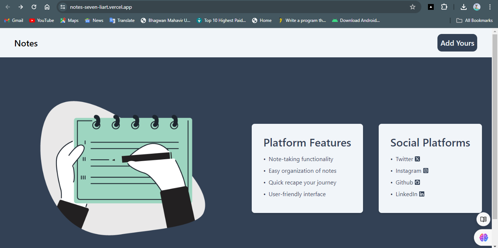
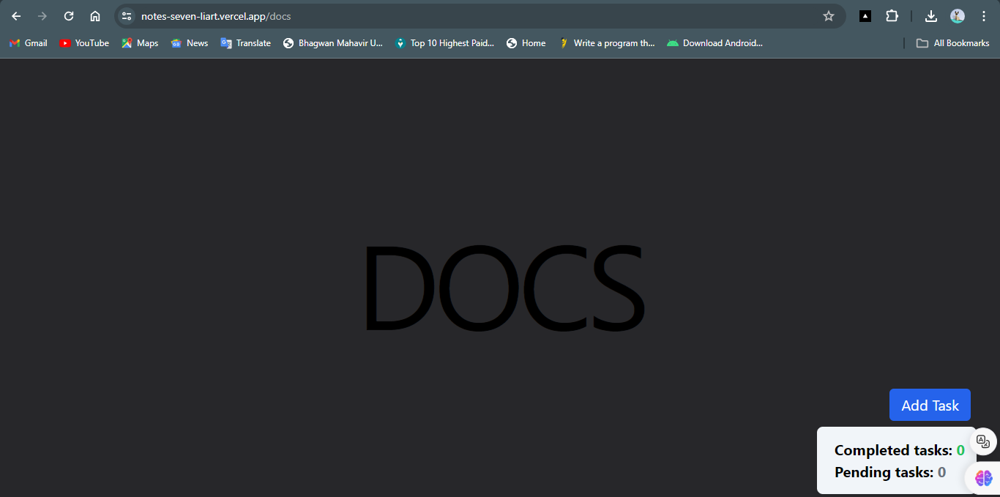
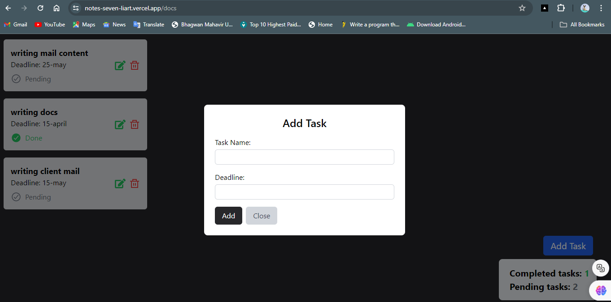
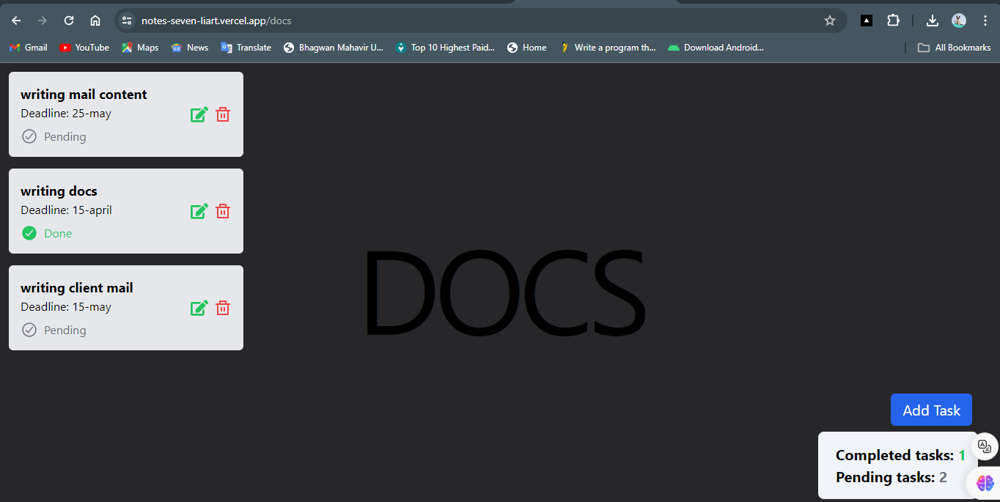
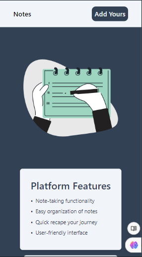
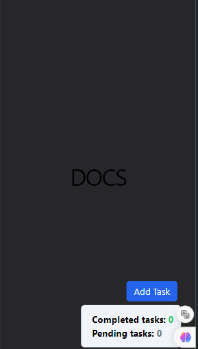
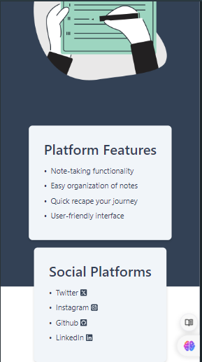
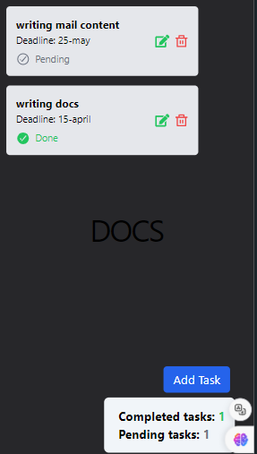

# Daily Task Tracker

Welcome to Daily Task Tracker! This platform is designed to help users manage their daily tasks effectively. Whether you have work deadlines, personal errands, or any other tasks, Daily Task Tracker allows you to input and track your tasks conveniently.

## Features

- **Task Management:** Create, update, and track your daily tasks, including setting deadlines or time limits.
- **Task Modification:** Easily modify task details, such as the task name or deadline, to adapt to changing priorities.
- **Task Completion:** Mark tasks as completed to keep track of your progress and accomplishments.
- **Data Insights:** View statistics about your tasks, including the number of completed tasks and pending tasks.

## Tech Stack

- **React.js:** React.js is used as the frontend framework for building the user interface of the platform, providing a responsive and interactive experience.
- **JavaScript:** JavaScript logic is utilized for task management functionalities, enabling dynamic updates and interactions.
- **Tailwind CSS:** Tailwind CSS is used for styling the user interface, offering customizable and reusable styling classes.
- **Framer Motion:** Framer Motion library is employed for adding animations and transitions to enhance the user experience.
- **Vercel:** Vercel platform is used for deployment and hosting, providing a seamless deployment process and reliable hosting services.

## Quick Start

### Home Page


### Task Management


### Task Details



### Responsive Design
<div style="overflow: auto; white-space: nowrap;">
  <a target="_blank" href="https://aryankadam.hashnode.dev/react-js-beginner-to-advanced">
    
  </a>
  <a target="_blank" href="https://aryankadam.hashnode.dev/react-js-beginner-to-advanced-series-2">
    
  </a>
  <a target="_blank" href="https://aryankadam.hashnode.dev/react-js-beginner-to-advanced">
    
  </a>
  <a target="_blank" href="https://aryankadam.hashnode.dev/react-js-beginner-to-advanced-series-2">
    
  </a>
</div>

## Getting Started

To get started with the project, follow these steps:

1. Clone the repository:
   ```
   git clone https://github.com/aryyan0701/notes.git
   ```
2. Navigate into the project directory:
   ```
   cd your_project_name
   ```
3. Install dependencies:
   ```
   npm install
   ```
4. Start the development server:
   ```
   npm run dev
   ```
5. Open your browser and visit `http://localhost:5137` to view the application.

## Usage

- Create new tasks by providing the task name and deadline.
- Update task details as needed, such as modifying task names or deadlines.
- Mark tasks as completed to track your progress and accomplishments.

## Contributors

- [Your Name](https://github.com/your_username) - Project Lead & Developer

## License

This project is licensed under the MIT License - see the [LICENSE](LICENSE) file for details.

## Acknowledgements

- React.js community for providing a powerful frontend library for building user interfaces.
- Tailwind CSS for offering a utility-first CSS framework for rapid prototyping and styling.
- Framer Motion for providing an easy-to-use animation library for enhancing user interactions.
- Vercel for simplifying the deployment process and providing hosting services.

## Further Help

- For more information on using React.js or Tailwind CSS, refer to their official documentation.
- If you need assistance with the project, feel free to reach out to the project lead or contributors.

Thank You ..!!